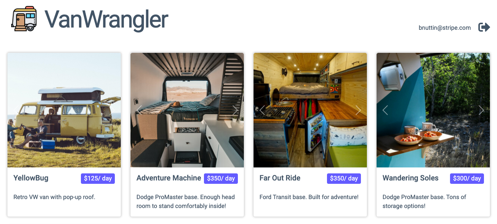

# VanWrangler

## The app

The app is a campervan reservation platform allowing users to:
1. Reserve a van
1. List a van for rental (planned)

Stripe technologies included in this demo:
1. Hosted Checkout page
1. Custom Elements payment form
1. Hosted Customer Portal
1. Subscriptions
1. Payment Intents
1. Identity verification (planned)
1. Express Connect (planned)

All users, products, prices, images are kept in the Stripe test account itself - the app does not need a local database.

## Running the app

Prior to running the app, ensure you have an .env file with the API keys in your root directory:
    `REACT_APP_PK=pk_test_xxxxx`
    `REACT_APP_SK=sk_test_xxxxx`

The server portion of the app can be run from `/src`: `node Server.js`.
The React portion of the app can be run the root directory: `npm start`.

The app will then load at [http://localhost:3000](http://localhost:3000) (note the server runs out of port 8081).

